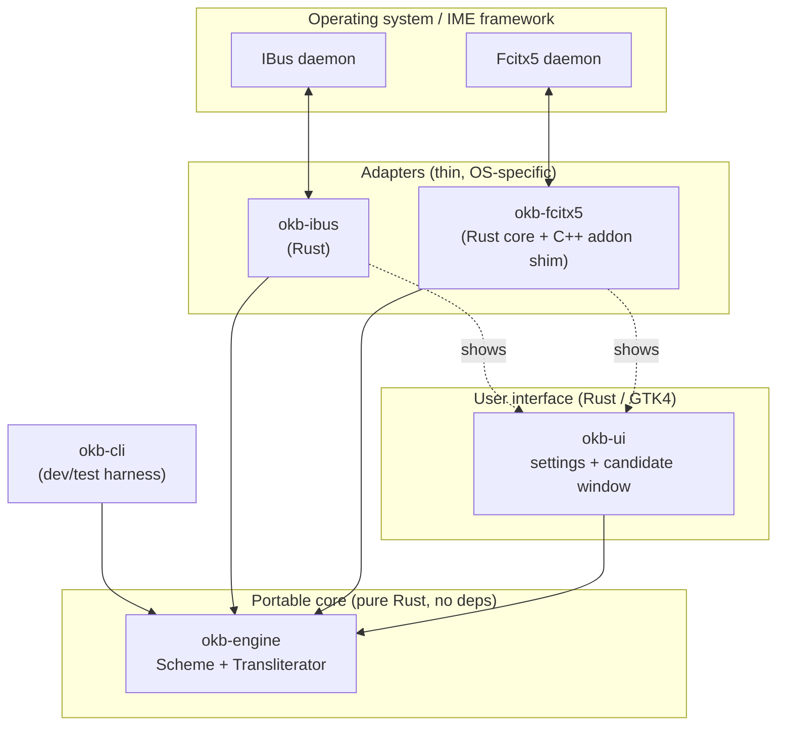
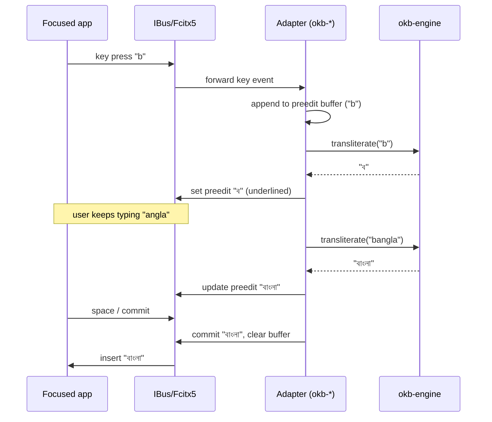

# Architecture overview

## Goal

A **system-wide input method** that lets a user type Bengali (and later other
scripts) in *any* application by typing phonetically in Latin letters —
`bangla` → `বাংলা`. First target OS: **Ubuntu**. First script: **Bengali**.

## Guiding principles

1. **Rust-first.** All logic and UI in safe Rust. C/C++ appears only at FFI
   boundaries a framework forces on us (Fcitx5's C++ addon API).
2. **A pure core.** The linguistic engine knows nothing about operating systems,
   input-method frameworks, or UI toolkits. Everything OS-specific is an *adapter*
   around it.
3. **Minimal dependencies.** The core has zero third-party crates. See
   [ADR-0005](../decisions/ADR-0005-dependency-policy.md).
4. **Security by construction.** `#![forbid(unsafe_code)]` in pure crates, a
   pinned lockfile, and CI supply-chain checks. See [security.md](security.md).
5. **Clean-room.** No code or data from Avro / OpenBangla or similar projects. See
   [ADR-0006](../decisions/ADR-0006-clean-room-phonetic-scheme.md).

## Layered structure

The key property: **`okb-engine` has no upward dependencies.** Adapters and UI
depend on it; it depends on nothing but `std`. This is what makes the same core
reusable across IBus, Fcitx5, and future platforms (Windows/TSF, macOS/IMK,
Android/IME, Wayland) without change.

## Crates

| Crate | Status | Language | Responsibility |
| ----- | ------ | -------- | -------------- |
| `okb-engine` | **implemented** | Rust (std-only) | Schemes, sounds, contextual transliteration. The linguistic brain. |
| `okb-ime` | **implemented** | Rust (std-only) | Framework-agnostic input-session logic: preedit buffer + commit/passthrough policy, shared by all adapters. |
| `okb-cli` | **implemented** | Rust | Command-line harness to exercise the engine before IME integration exists. |
| `okb-ibus` | **implemented** | Rust (zbus) | IBus engine: pure-Rust D-Bus adapter driving `okb-ime`. Confirmed working end-to-end on Ubuntu/GNOME (see [ibus-setup](../development/ibus-setup.md)). |
| `okb-fcitx5` | planned (Phase 3) | Rust + C++ FFI | Fcitx5 addon wrapping the engine (reuses `okb-ime`). |
| `okb-ui` | planned (Phase 4) | Rust (GTK4) | Preferences window and candidate/suggestion popup. |
| `okb-ffi` | planned (as needed) | Rust (C ABI) | Stable C ABI over the engine for the C++ Fcitx5 shim. |

## Data flow (typing a character)

The engine is **stateless per call** today: adapters own the preedit buffer and
re-transliterate it. This keeps the core trivial to test and reason about. A
future incremental/streaming API is noted in the [roadmap](../roadmap.md) but is
an optimisation, not a requirement.

## Why IME (not an on-screen keyboard or editor)

An IME is the only design that lets a user type Bengali in **every** application.
See [ADR-0001](../decisions/ADR-0001-product-type-ime.md).

## Why both IBus and Fcitx5

IBus is Ubuntu/GNOME's default (works out of the box); Fcitx5 is the modern,
lower-latency, more extensible framework preferred by power users. Supporting both
maximises reach, and the adapter pattern makes the incremental cost small. See
[ADR-0002](../decisions/ADR-0002-ime-frameworks.md).

## References (prior art studied, not copied)

- OpenBangla Keyboard — <https://github.com/OpenBangla/OpenBangla-Keyboard>
- riti engine (Rust) — <https://github.com/OpenBangla/riti>
- Fcitx5 framework — <https://github.com/fcitx/fcitx5>
- IBus — <https://github.com/ibus/ibus>
- Unicode Bengali block (U+0980–U+09FF) — <https://www.unicode.org/charts/PDF/U0980.pdf>
