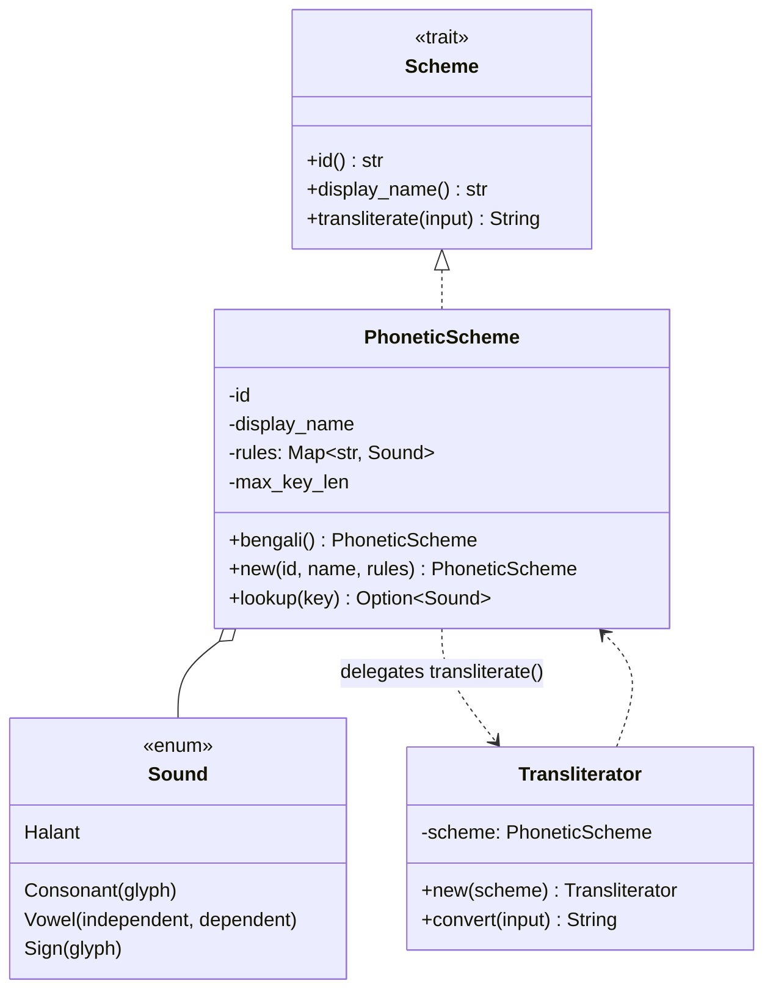

# Engine design (`okb-engine`)

The engine converts a Latin ("English") input buffer into target-script Unicode
text. It is pure, dependency-free Rust and is the reusable brain behind every
frontend.

## Object model

- **`Scheme`** is the abstraction every frontend depends on. New scripts/layouts
  are new `Scheme` implementations; adapters never change.
- **`Sound`** makes the *kind* of each unit explicit (consonant / vowel /
  sign / virama) so orthography rules can be applied generically rather than being
  baked into a flat glyph map.
- **`PhoneticScheme`** is a rule table (`Latin key → Sound`) plus the longest key
  length, so lookups are a bounded longest-match.
- **`Transliterator`** carries the per-conversion syllable state.

## The transliteration algorithm

Given an input buffer, `Transliterator::convert`:

1. Collects the input into a `Vec<char>` (so multi-byte handling is correct).
2. Walks left to right. At each position it tries the **longest** rule key that
   matches (window = `min(max_key_len, remaining)`, shrinking to 1). This is why
   `chh` (ছ) wins over `ch` (চ) over `c` (চ).
3. Emits the matched `Sound` through `apply`, updating a single piece of state:
   `pending_consonant` — whether the last glyph was a consonant base.
4. Unmatched characters (spaces, most punctuation) pass through unchanged and reset
   `pending_consonant`.

### `apply` rules (Bengali orthography)

| Sound | If `pending_consonant` | Else | New state |
| ----- | ---------------------- | ---- | --------- |
| `Consonant(g)` | emit virama `্` then `g` (conjunct) | emit `g` | pending = true |
| `Vowel{ind, dep}` | emit `dep` (কার sign) | emit `ind` (independent) | pending = false |
| `Sign(g)` | emit `g` | emit `g` | pending = false |
| `Halant` | emit virama `্` | emit virama `্` | pending = false |

This captures three core Bengali behaviours:

- **Inherent vowel:** a bare consonant already sounds *ô*, so there is no key for
  it; `k` → `ক`.
- **Dependent vs independent vowels:** `o` after a consonant is a কার sign (`কো`),
  but word-initially it is the independent letter (`ও`).
- **Conjuncts (যুক্তাক্ষর):** two consonants in a row are joined by the virama;
  `kt` → `ক্ত`.

## Statelessness and the future streaming API

Today the engine is **stateless between calls**: the adapter keeps the preedit
buffer and re-transliterates the whole thing on each keystroke. Buffers are short
(a word), so this is cheap and makes the core trivial to test.

A future incremental API (feed one key, get a delta) is noted in the
[roadmap](../roadmap.md) as an optimisation for very long buffers; it is not needed
for correctness.

## Testing

Behaviour is pinned by unit tests in `crates/engine/src/transliterate.rs` and a
doctest in `lib.rs`. Each orthography rule and the longest-match behaviour has at
least one test. Add a test for every new rule or edge case.

## Extending

- **New rules / fixing a mapping:** edit `PhoneticScheme::bengali` in
  `crates/engine/src/scheme.rs` and add a test. Keep
  [design/phonetic-scheme.md](phonetic-scheme.md) in sync.
- **New layout (e.g. a fixed/Probhat-style keyboard):** add another constructor or a
  new `Scheme` impl. Fixed layouts map single keys to glyphs and may not need the
  syllable state machine.
- **New script (Hindi, Tamil, …):** implement `Scheme` with that script's rules and
  orthography. The `Sound` model already generalises to other Brahmic scripts
  (inherent vowel + dependent signs + virama); non-Brahmic scripts may add variants.
