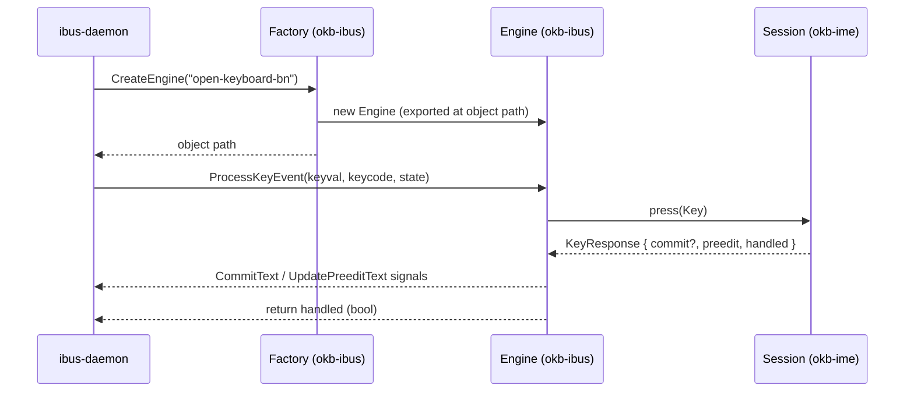

# Installing & testing the IBus engine (Ubuntu)

This guide covers building, installing, enabling, and testing the open-keyboard
IBus engine (`okb-ibus`) on Ubuntu/GNOME.

> ## Status
>
> **Confirmed working end to end on Ubuntu/GNOME (IBus) as of 2026-09-27** — typing
> phonetic Latin commits Bengali into real applications. Composing text is shown
> underlined and commits on space/enter.
>
> In addition, the engine's pure logic is unit-tested and the crate passes
> `clippy -D warnings`:
> - keyval/modifier → key mapping ([`keymap`](../../crates/ibus/src/keymap.rs)),
> - the `IBusText` D-Bus wire format, pinned by signature tests
>   ([`ibus_text`](../../crates/ibus/src/ibus_text.rs)),
> - the shared session policy ([`okb-ime`](../../crates/ime/src/session.rs)).
>
> Broader testing across distros, desktops (KDE, etc.), and Wayland/X11 is ongoing;
> please [report bugs](../../CONTRIBUTING.md#reporting-bugs) if you hit any.

## Prerequisites

```bash
sudo apt update
sudo apt install ibus rustup   # or install Rust via https://rustup.rs
ibus --version                 # confirm IBus is present
```

Ubuntu ships IBus by default under GNOME. Make sure IBus is the active input-method
framework (`echo $GTK_IM_MODULE` typically shows `ibus`).

## Install

```bash
# from the repository root
make install          # builds release + installs binary + component, restarts IBus
# equivalently: packaging/install.sh
```

This installs:

- the engine binary → `/usr/lib/ibus-open-keyboard/okb-ibus-engine`
- the component descriptor → `/usr/share/ibus/component/open-keyboard.xml`

## Enable the input source

GNOME Settings → **Keyboard** → **Input Sources** → **+** → **Bengali** →
**“Bengali (open-keyboard, phonetic)”**.

Then switch to it with **Super + Space** (cycle input sources). You can also select it
from the terminal:

```bash
ibus engine open-keyboard-bn
```

If it doesn't show up, **log out and back in** so GNOME re-reads the input sources.

## Test

Open any text field (browser, gedit, terminal) and type:

| Type | Expect |
| ---- | ------ |
| `amar sonar bangla ` | আমার সোনার বাংলা |
| `ami bangla likhi ` | আমি বাংলা লিখি |
| `bhalo ` | ভালো |

The word appears underlined (preedit) as you type and commits on space/enter. See the
full [phonetic scheme](../design/phonetic-scheme.md) for what to type.

## Debugging

Run the engine by hand to see its logs (stop the daemon-spawned one first if needed):

```bash
# Ensure IBus is running, then:
IBUS_ADDRESS="$(ibus address)" /usr/lib/ibus-open-keyboard/okb-ibus-engine --ibus
```

Watch IBus itself:

```bash
# Restart IBus in the foreground with debug output
ibus-daemon -vdr --panel=disable
```

Inspect that the component is registered:

```bash
ibus list-engine | grep -i open-keyboard || echo "engine not registered"
```

Common issues:

- **Engine missing from the list** → component XML not found or malformed; re-run
  `make install`, then `ibus restart`, then re-log-in.
- **Nothing happens when typing** → the engine process may have failed to connect;
  run it by hand (above) and check the error.
- **Wrong output** → likely a scheme issue, not transport; reproduce with
  `cargo run -p okb-cli -- <text>` and open it as a scheme fix.

## Uninstall

```bash
make uninstall        # or packaging/uninstall.sh
```

## How it works



The engine is a thin transport; all typing behaviour lives in `okb-ime` and
`okb-engine`, which are unit-tested independently.
